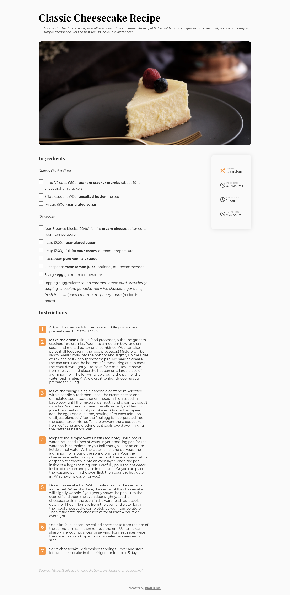
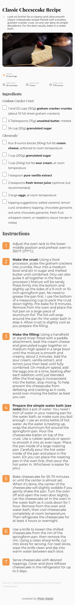

<!-- Please update value in the {}  -->

<h1 align="center">Recipe page</h1>

   Solution for a challenge from  <a href="http://devchallenges.io" target="_blank">Devchallenges.io</a>.

  <h3>
    <a href="https://pietyr.github.io/recipe-page/">
      Demo
    </a>
     | 
    <a href="https://github.com/pietyr/recipe-page">
      Solution
    </a>
     | 
    <a href="https://devchallenges.io/challenges/OEKdUZ6xs0h99C38XVht">
      Challenge
    </a>
  </h3>

<!-- TABLE OF CONTENTS -->

## Table of Contents

-   [Overview](#overview)
    -   [Desktop view](#desktop-view)
    -   [Mobile view](#mobile-view)
    -   [Built With](#built-with)
    -   [What new have I learned](#what-new-have-i-learned)
-   [Features](#features)
-   [Contact](#contact)

<!-- OVERVIEW -->

## Overview

### Desktop view

### Mobile view

### Built With

<!-- This section should list any major frameworks that you built your project using. Here are a few examples.-->

-   HTML
-   CSS

### What new have I learned

-   Styling ordered lists

## Features

<!-- List the features of your application or follow the template. Don't share the figma file here :) -->

This application/site was created as a submission to a [DevChallenges](https://devchallenges.io/challenges) challenge. The [challenge](https://devchallenges.io/challenges/TtUjDt19eIHxNQ4n5jps) was to build an application to complete the following user stories:

-   [x] **User story**: _I can see a recipe with ingredients and instructions_
-   [x] **User story**: _I can select a checkbox if I have the ingredients_
-   [x] **User story**: _I can see the number of servings, baking times_

## Contact

-   GitHub [@pietyr](https://github.com/pietyr)
